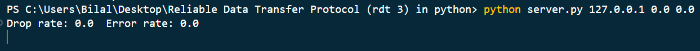
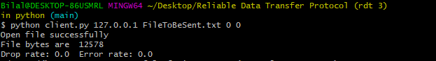

# Reliable Data Transfer (rdt 3.0) in Python

# Guide to use
1. Create a directory `Store` if it doesn't already exist inside the main folder
1. First run the `server.py` file along with the following arguments 

    `python server.py <IP Address> <Drop rate> <Error Rate>`

    `python server.py 127.0.0.1    0.1     0.1`

    

2. Now open another terminal and run the `client.py` file

    `python client.py <IP Address> <File name> <Drop rate> <Error Rate>`

    `python client.py 127.0.0.1 FileToBeSent.txt 0 0`
    

3. Now press `Enter`key on the client side to begin the file transfer.
4. Once the file transfer is complete the file would be found in the `Store` directory of this folder.
    